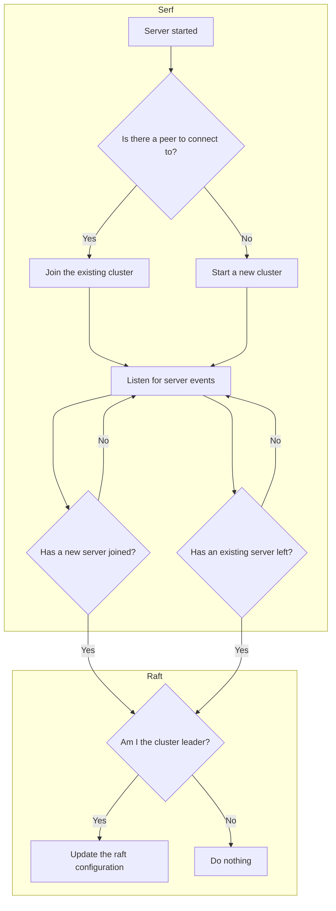

# Clustering

In order to operate in a high-availability configuration, we need to be able to
run multiple replicas of the server and ensure the state is consistent across
all replicas.

To do this, we use the [HashiCorp implementation of the Raft consensus algorithm](https://github.com/hashicorp/raft)
which has all servers in the cluster vote for a leader. The leader is then
responsible for write operations which are propagated to the following servers
via a replicated log.

In the event that the leader server fails, or is lost due to scaling down the
cluster, an election is made to pick a new leader.

In order to build a cluster, servers need to be aware of each other so that
they may be added and removed from the raft configuration as they come up
and down. To achieve this, we use [HashiCorp serf](https://github.com/hashicorp/serf)
which provides a leaderless discovery system that allows the servers to monitor
the addition and removal of new servers, adding and removing them from the
raft configuration appropriately.

The raft and serf state are persisted on disk at a configurable location and
have fixed names of `serf.db` and `raft.db`. These should be persisted across
restarts to minimise replaying the entire raft log and to allow the server
to reconnect to its previously known serf cluster.

The flow for a server joining the cluster looks something like this:

The implementation for this can be viewed in the `internal/server` package
within the source code.
