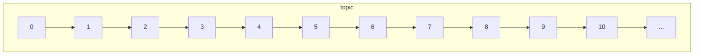

# Topics

A topic represents an append-only log of messages published by one or more
clients. Each message published onto a topic is assigned an ordinal identifier.
The lower the identifier, the earlier in time the message was published.

The best way to use topics is for splitting your messages by domain. For
example, say you are tracking changes in personal data across many users.
You may have a `users` topic with message types like `BirthdayChanged` or
`NameChanged` which describe the changes to that user's birthday and name
respectively. Because you're using protocol-buffers as messages, you can
easily determine the type of event you've received. Having a single topic
per message type is also fine, but will require much more configuration and
code for your consumers.

## Node Assignment

In order for multiple consumers to work together to get through a topic's
messages faster/in-parallel, each topic is assigned to a node in the cluster,
known as the topic owner. Topics are assigned to a node on creation, and will
be reassigned to a different node should their current node be removed from the
cluster. Clients are responsible for checking which node owns a topic before
consuming, attempting to consume messages from a topic not assigned to the node
will result in an error.

Topics will be assigned/reassigned to nodes based on whichever node currently
has the least number of assigned topics. The distribution of topics across
nodes should be relatively even. The cluster leader is responsible for the
distribution of topics across nodes.

When a new node is added to the cluster, existing topics will not be reassigned
to it, but newly created topics will until it has the same number of topics as
another node. At this point, topic distribution will be even again.
